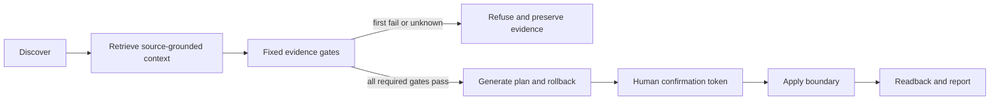

```mermaid
flowchart LR
    D["Discover"] --> R["Retrieve source-grounded context"]
    R --> G["Fixed evidence gates"]
    G -->|first fail or unknown| F["Refuse and preserve evidence"]
    G -->|all required gates pass| P["Generate plan and rollback"]
    P --> C["Human confirmation token"]
    C --> A["Apply boundary"]
    A --> V["Readback and report"]
```
