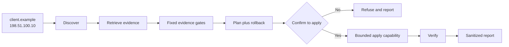

```mermaid
flowchart LR
  U["client.example<br/>198.51.100.10"] --> D["Discover"]
  D --> R["Retrieve evidence"]
  R --> G["Fixed evidence gates"]
  G --> P["Plan plus rollback"]
  P --> C{"Confirm to apply"}
  C -->|No| F["Refuse and report"]
  C -->|Yes| A["Bounded apply capability"]
  A --> V["Verify"]
  V --> O["Sanitized report"]
```
